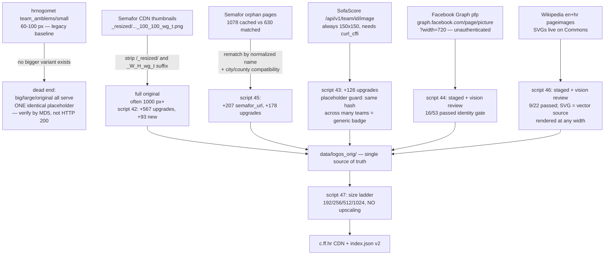
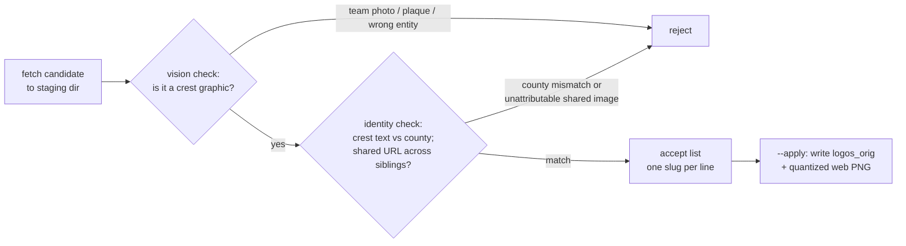
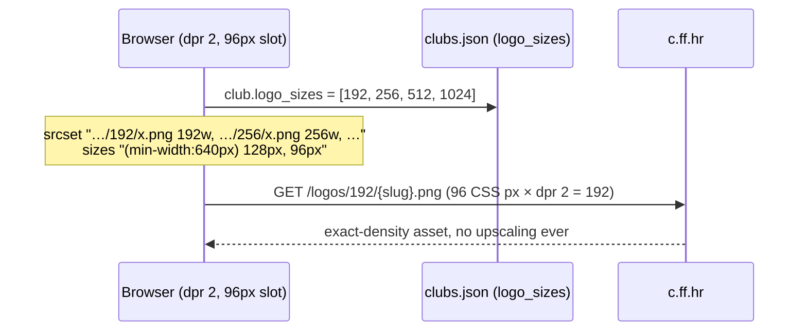

# Club logo pipeline — sources, CDN, size ladder

How the catalog went from ~60–100 px thumbnails to a systematic, multi-resolution
crest catalog for all **1014 clubs**, served from a public CDN at **`c.ff.hr`**
(R2 bucket `c-ff-hr`, "football fans"). This documents everything learned while
building scripts `42`–`47` — including the traps, because the traps are the
expensive part to re-learn.

## TL;DR state (2026-07-10)

| Asset | Where | Count |
|---|---|---|
| Web default (≤512 px, quantized PNG) | `data/logos/{slug}.png` → `https://c.ff.hr/logos/{slug}.png` | 1014 (100%) |
| Size ladder | `data/logos_sized/{192,256,512,1024}/{slug}.png` → `https://c.ff.hr/logos/{size}/{slug}.png` | 763 / 635 / 222 / 63 |
| Source of truth | `data/logos_orig/{slug}.{svg,png,jpg,gif}` → `https://c.ff.hr/originals/…` | 723 (4 SVG) |
| Machine index | `https://c.ff.hr/index.json` — per club: `logo`, `original`, `svg`, `sizes[]` | 1014 |

Width distribution of the web catalog moved from **592 clubs < 100 px** to
**93 < 100 px / 635 ≥ 256 px**. The residual ~93 tiny crests have no reachable
source anywhere (no Semafor, SofaScore, usable Facebook, or Wikipedia asset);
upscaling was deliberately rejected — a blurry big crest is worse than an honest
small one.

## Source cascade

Priority is "same image, bigger file" first, then new sources gated by identity
checks. Everything is idempotent and re-runnable.

### Per-source notes

- **Semafor (`hns.family`)** — the single biggest win. Thumbnail URLs like
  `…/images_comet/Club/_resized/{id}_{hash}_100_100_wg_t.png` hide the original
  at `…/images_comet/Club/{id}_{hash}.png`. Works for the hash-sharded path
  variant (`…/images_comet/{aa}/{b}/{hash}.ext`) too. Some club pages embed the
  original URL directly (no `_resized/`) — fetch it as-is.
- **hrnogomet** — `small` is the only real size. Every other path segment
  (`big`, `large`, `original`, …) returns HTTP 200 with the *same* 4010-byte
  placeholder. Lesson: **validate variant probing with content hashes**.
- **SofaScore** — Cloudflare-blocked for plain HTTP clients; `curl_cffi` with
  `impersonate="chrome124"` is required (see `reference_sofascore` memory /
  scripts 01, 07). Serves exactly 150×150.
- **Facebook Graph** — `https://graph.facebook.com/{page}/picture?type=large&width=720&height=720`
  works without any token and follows to the CDN file. But a page's profile
  picture is *not guaranteed to be the crest* — real failure modes we hit:
  team photos, anniversary variants, a fan-club logo (Društvo prijatelja
  Hajduka on three different NK Hajduk rows), a radio station (ICV on NK Drava),
  empty-avatar silhouettes.
- **Wikipedia/Commons** — top-tier crests exist as **SVG** (Dinamo, Rijeka,
  Istra 1961, Lokomotiva). Render any width via
  `https://commons.wikimedia.org/wiki/Special:FilePath/{file}.svg?width=1024`
  or locally with `rsvg-convert`. Failure modes: namesake articles (four
  different "NK Croatia (X)" rows all matched *NK Croatia Đakovo*, a defunct
  1971–2012 club), **outdated-era logos** (the `NK Varazdin (Logo 2010).svg` on
  Commons is the bankrupt Varteks-era club, not today's NK Varaždin), stadium
  photos and graffiti shots returned as the article's pageimage, and crest
  *photographs* (plaque on a wall) that are high-res but not catalog graphics.

## Identity gating — the actual hard part

Fetching bytes is trivial; attributing them to the right club is not. Two data
quirks make naive matching dangerous:

1. **`fb_url` is bulk-misassigned across sibling clubs.** Disambiguated rows
   (`NK X (A)`, `NK X (B)`) frequently share one Facebook URL that belongs to
   only one of them — e.g. `NK Budućnost (G)` (Osječko-baranjska) pointing at
   `NKBuducnostResetari` (Rešetari, Brodsko-posavska).
2. **`clubs.city` is unreliable on `(X)`-disambiguated slugs** (bulk backfill
   artifact — e.g. `NK Rudar (S)` with city "Mursko Središće" but county
   Šibensko-kninska). **Trust `county` over `city`** for identity decisions.

Staging directories (`data/verification/fb_logo_candidates/`,
`data/verification/wiki_logo_candidates/` + `manifest.tsv`) are kept out of git
but the **accept-list workflow is the contract**: nothing reaches the catalog
without passing both gates. Rejection rate was meaningful — 37/53 (FB) and
13/22 (Wikipedia).

## Size ladder & no-upscale policy

`scripts/47_render_logo_sizes.py` renders `192/256/512/1024` from
`logos_orig`:

- **SVG sources** render every tier (`rsvg-convert -w S -h S --keep-aspect-ratio`).
- **Raster sources** render only tiers ≤ their native max dimension — a 150 px
  crest has *no* 192 tier, on purpose. Consumers read `sizes[]` from
  `index.json` (or `logo_sizes` in the frontend's `clubs.json`) and fall back
  to the largest available, then to the legacy `logos/{slug}.png` default.
- All web PNGs are 256-color quantized (`FASTOCTREE`) — ~80% smaller, visually
  lossless on flat crest art (65 MB → 15 MB for the default set).

Frontend integration (commit `42f172d`, `19806ee`, `41e2fe9`): `logoSrcSet()`
in `frontend/src/lib/data.ts`, `` in ClubLogo / Club hero /
Map popup; the fixed square is only an invisible alignment footprint — crests
render in natural aspect ratio, and the grey box appears solely for the
missing-crest fallback (Lucide `Shield`).

## CDN operations (R2 `c-ff-hr`, ff.hr account)

- Upload: per-object `wrangler r2 object put c-ff-hr/{key} --file … --remote
  --content-type … --cache-control "public, max-age=2592000"` with
  `CLOUDFLARE_ACCOUNT_ID` set to the ff.hr account. Works over the existing
  wrangler OAuth login — **no R2 API token needed**. ~4 parallel workers stay
  under API rate limits; 3.5 k objects ≈ 25 min.
- CORS: `GET/HEAD` from `*` (set via `wrangler r2 bucket cors set`).
- `wrangler r2 bucket info` **lags** (`object_count: 0` right after upload) —
  verify via public URLs, not bucket stats.
- **Edge-cache staleness**: overwriting an existing key keeps serving the old
  cached body for up to the 30-day TTL on URLs that were already fetched.
  Either purge the zone (dash → Caching → Purge) or treat keys as immutable
  and version them. New keys (the size tiers) are always fresh.
- `index.json` is uploaded with `max-age=3600`.

## PWA / service-worker gotcha

`vite-plugin-pwa` with `registerType: "autoUpdate"` means existing visitors get
a new deploy only on their *second* navigation (first visit downloads the new
SW in the background). When visually verifying a deploy in a browser profile
that has visited the site before: unregister the SW + clear CacheStorage, or
reload twice. The SW runtime cache for logos keys on the `c.ff.hr` origin
(`klubovi-logos-v2`).

## Residual work (if ever needed)

- ~93 clubs still < 100 px with zero reachable sources — the only remaining
  path is a Google Images / Firecrawl search pass with the same
  stage → vision → accept-list workflow, or leaving them honest-small.
- `croatia-orehovica` has a high-res *photo* of its crest on Commons
  (1179×1621) — rejected as a photo; a future crest-extraction/redraw pass
  could use it.
- The fb_url misassignment pattern found here (§ identity gating) also affects
  the SMS/outreach dataset — worth a dedicated cleanup pass before any
  Facebook-based outreach.
